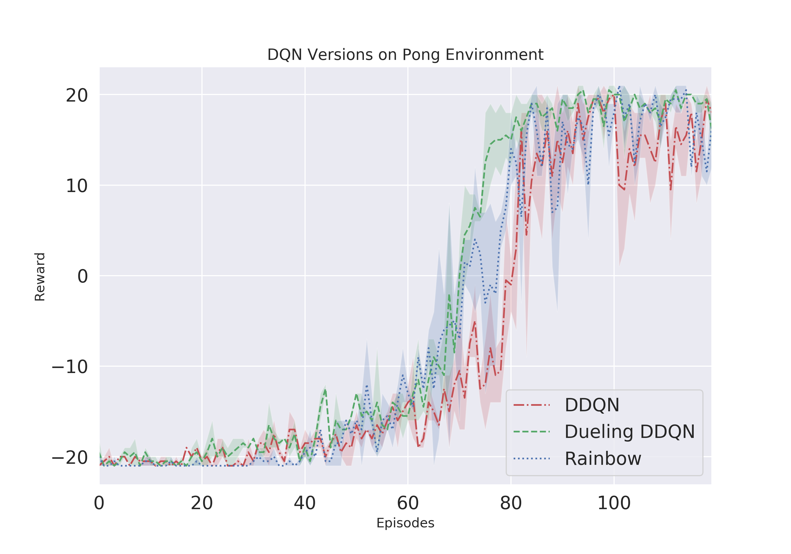

## DQN-Atari-Agents
Modularized training of different DQN Algorithms.

This repository contains several Add-ons to the base DQN Algorithm. All versions can be trained from one script and include the option to train from raw pixel or ram digit data. Recently added multiprocessing to run several environments in parallel for faster training. 

Following DQN versions are included:

- DDQN
- Dueling DDQN

Both can be enhanced with **Noisy layer**, **Per** (Prioritized Experience Replay), **Multistep Targets** and be trained in a **Categorical version (C51)**. Combining all these add-ons will lead to the *state-of-the-art* Algorithm of value-based methods called: **Rainbow**. 

#### Planned Add-ons:
- Parallel Environments for faster training (wall clock time) [X]
- Munchausen RL [ ]
- DRQN (recurrent DQN) [ ]
- Soft-DQN [ ]
- Curiosity Exploration [ ]


## Train your Agent:
#### Dependencies
Trained and tested on:
<pre>
Python 3.6 
PyTorch 1.4.0  
Numpy 1.15.2 
gym 0.10.11 
</pre>

To train the base DDQN simply run ``python run_atari_dqn.py``
To train and modify your own Atari Agent the following inputs are optional:

*example:* ``python run_atari_dqn.py -env BreakoutNoFrameskip-v4 -agent dueling -u 1 -eps_frames 100000 -seed 42 -info Breakout_run1``
- agent: Specify which type of DQN agent you want to train, default is DQN - baseline! **Following agent inputs are currently possible:** ``dqn``, ``dqn+per``, ``noisy_dqn``, ``noisy_dqn+per``, ``dueling``, ``dueling+per``, ``noisy_dueling``, ``noisy_dueling+per``, ``c51``, ``c51+per``, ``noisy_c51``, ``noisy_c51+per``, ``duelingc51``, ``duelingc51+per``, ``noisy_duelingc51``, ``noisy_duelingc51+per``, ``rainbow``
- env: Name of the atari Environment, default = PongNoFrameskip-v4
- frames: Number of frames to train, default = 5 mio
- seed: Random seed to reproduce training runs, default = 1
- bs: Batch size for updating the DQN, default = 32
- layer_size: Size of the hidden layer, default=512
- n_step: Number of steps for the multistep DQN Targets 
- eval_every, Evaluate every x frames, default = 50000
- eval_runs, Number of evaluation runs, default = 5
- m: Replay memory size, default = 1e5
- lr: Learning rate, default = 0.00025
- g: Discount factor gamma, default = 0.99
- t: Soft update parameter tat, default = 1e-3
- eps_frames: Linear annealed frames for Epsilon, default = 150000
- min_eps: Epsilon greedy annealing crossing point. Fast annealing until this point, from there slowly to 0 until the last frame, default = 0.1
- info: Name of the training run.
- fill_buffer: Adding samples to the replay buffer based on a random policy, before agent-env-interaction. Input numer of preadded frames to the buffer, default = 50000
- save_model: Specify if the trained network shall be saved [1] or not [0], default is 1 - saved!
- w, --worker: Number of parallel environments

#### Training Progress can be view with Tensorboard
Just run ``tensorboard --logdir=runs/``

# Atari Games Performance:

## Pong:
Hyperparameters:
- batch_size: 32
- seed: 1
- layer_size: 512
- frames: 300000
- lr: 1e-4
- m: 10000
- g: 0.99
- t: 1e-3
- eps_frames: 100000
- min_eps: 0.01
- fill_buffer: 10000




## Convergence prove for the CartPole Environment
Since training for the Algorithms for Atari takes a lot of time I added a quick convergence prove for the CartPole-v0 environment. You can clearly see that Raibow outperformes the other two methods Dueling DQN and DDQN.


To reproduce the results following hyperparameter where used:
- batch_size: 32
- seed: 1
- layer_size: 512
- frames: 30000
- lr: 1e-3
- m: 500000
- g: 0.99
- t: 1e-3
- eps_frames: 1000
- min_eps: 0.1
- fill_buffer: 50000

Its interesting to see that the add-ons have a negative impact for the super simple CartPole environment. Still the Dueling DDQN version performs clearly better than the standard DDQN version.


## Parallel Environments

To reduce wall clock time while training parallel environments are implemented. Following diagrams show the speed improvement for the two envrionments CartPole-v0 and LunarLander-v2. Tested with 1,2,4,6,8,10,16 worker. Each number of worker was tested over 3 seeds.  

<p float="left">
  
   
</p>
<p float="left">
  
   
</p>

Convergence behavior for each worker number can be found: [CartPole-v0](https://github.com/BY571/DQN-Atari-Agents/blob/master/imgs/Worker_convergent_CP.png) and [LunarLander](https://github.com/BY571/DQN-Atari-Agents/blob/master/imgs/Worker_convergent_LL.png)


## Help and issues:
Im open for feedback, found bugs, improvements or anything. Just leave me a message or contact me.

### Paper references:

- [DQN](https://arxiv.org/abs/1312.5602)
- [Dueling DQN](https://arxiv.org/abs/1511.06581)
- [Noisy layer](https://arxiv.org/pdf/1706.10295.pdf)
- [C51](https://arxiv.org/pdf/1707.06887.pdf)
- [PER](https://arxiv.org/pdf/1511.05952.pdf)
- [Rainbow](https://arxiv.org/pdf/1710.02298.pdf)
- [DRQN](https://arxiv.org/abs/1507.06527)

## Author
- Sebastian Dittert

**Feel free to use this code for your own projects or research.**
For citation:
```
@misc{DQN-Atari-Agents,
  author = {Dittert, Sebastian},
  title = {DQN-Atari-Agents:   Modularized PyTorch implementation of several DQN Agents, i.a. DDQN, Dueling DQN, Noisy DQN, C51, Rainbow and DRQN},
  year = {2020},
  publisher = {GitHub},
  journal = {GitHub repository},
  howpublished = {\url{https://github.com/BY571/DQN-Atari-Agents}},
}
